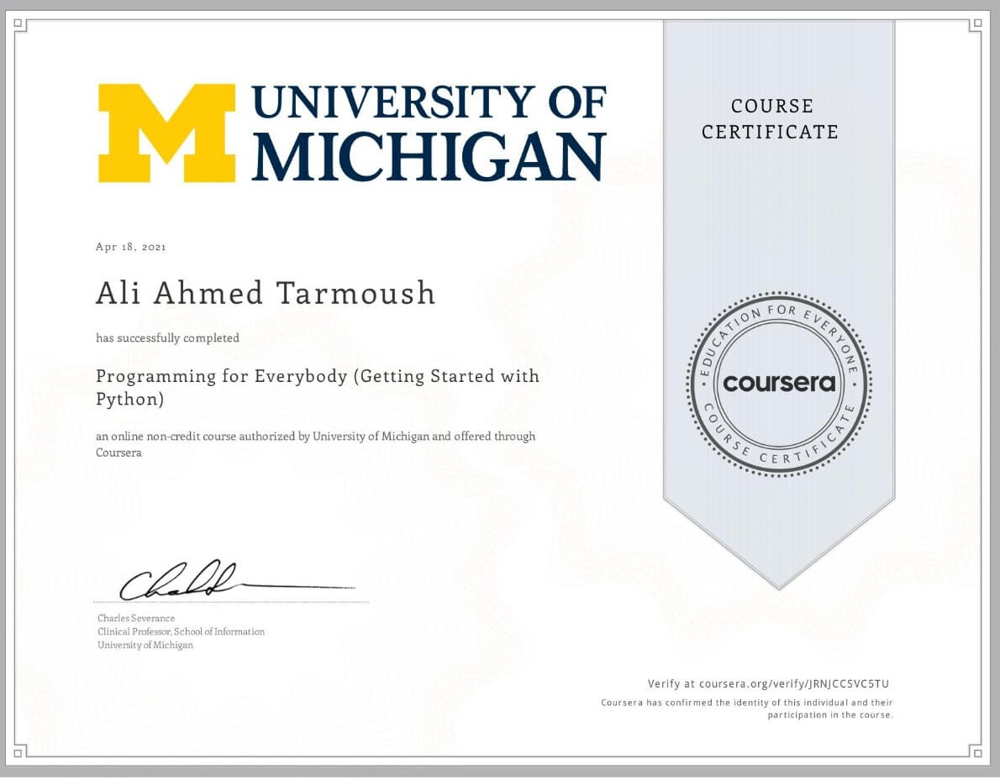
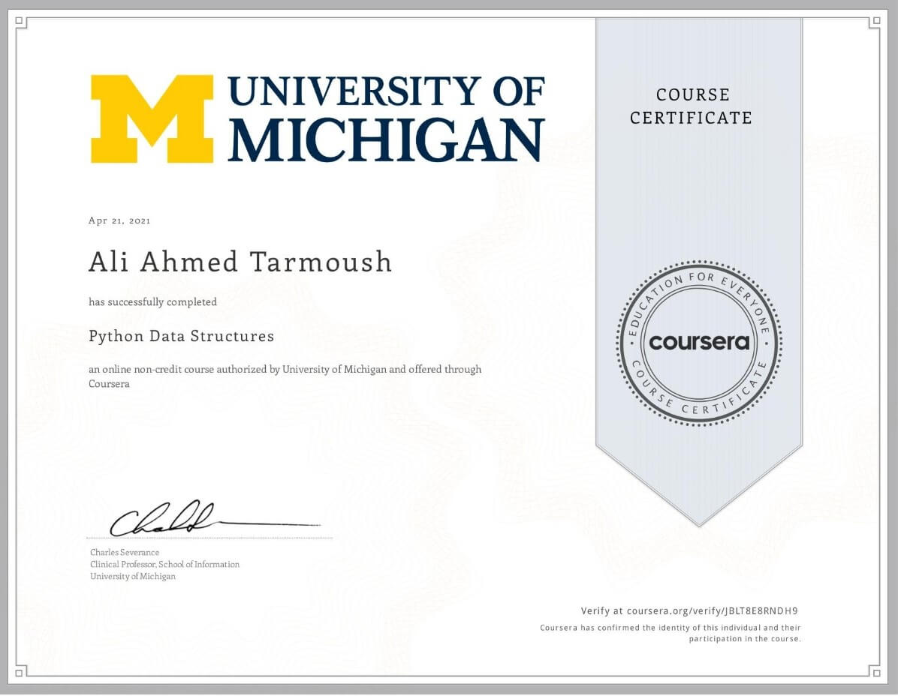

# About this Specialization

This Specialization builds on the success of the Python for Everybody course and will introduce fundamental programming concepts including data structures, networked application program interfaces, and databases, using the Python programming language. In the Capstone Project, you’ll use the technologies learned throughout the Specialization to design and create your own applications for data retrieval, processing, and visualization.

# COURSE 1: Programming for Everybody (Getting Started with Python)

  

# COURSE 2: Python Data Structures

  

# COURSE 3: Using Python to Access Web Data

# COURSE 4: Using Databases with Python

# COURSE 5: Capstone Retrieving Processing and Visualizing Data with Python
